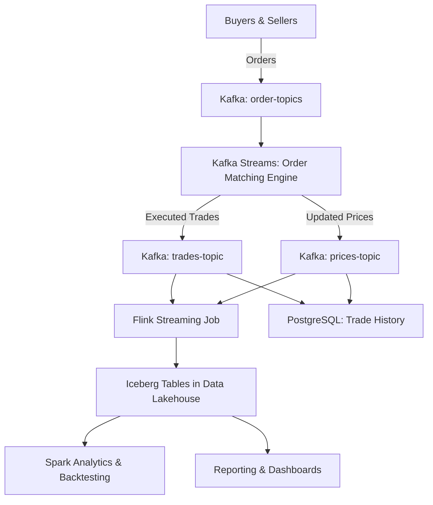

# 🏦 Stock Market Simulation Platform

## 📌 Overview

This project is a **microservices-based stock market simulation platform** designed to model the behavior of a financial exchange. It provides a realistic environment where **buyers, sellers, order matching, and reporting systems** interact in real-time.

The platform demonstrates key concepts in **quantitative finance, distributed systems, and data engineering** by leveraging a modern data infrastructure, including **Kafka Streams, Apache Flink, Apache Spark, and Apache Iceberg**.

The goal of the project is to **simulate stock trading**, **generate real-time market data**, and **enable reporting & analytics** through a scalable **lakehouse architecture**.

## ⚙️ Architecture

### Components

* **Buyers & Sellers (Microservices)**

  * Generate simulated buy/sell orders for multiple stocks.
  * Interact with the order matching engine through Kafka.

* **Order Matching Engine (Kafka Streams)**

  * Maintains the **order book** for each stock.
  * Matches buy and sell orders in real-time.
  * Publishes **executed trades** and **updated stock prices** to Kafka topics.

* **Apache Kafka**

  * Central messaging bus for **orders, trades, prices, and portfolio updates**.
  * Provides topics for downstream services (reporting, storage, analytics).

* **Apache Flink (Streaming Analytics)**

  * Consumes Kafka topics in real-time.
  * Writes streaming data (trades, prices, portfolios) into **Apache Iceberg** tables.
  * Performs **real-time aggregations** (e.g., moving averages, volatility).

* **Apache Spark (Batch + Query)**

  * Processes historical trade and order book data.
  * Runs **analytical queries** and **backtesting strategies** on Iceberg tables.

* **Apache Iceberg (Data Lakehouse)**

  * Stores structured financial data in a **transactional, queryable format**.
  * Enables **time travel queries** for historical market reconstruction.
  * Integrates with Spark/Flink/Trino for reporting.

* **PostgreSQL (OLTP)**

  * Stores **user profiles, portfolio balances, and trade history snapshots**.
  * Acts as the operational database for the simulation.

* **Reporting & Dashboards**

  * Uses Spark SQL / Flink SQL / Trino queries on Iceberg.
  * Provides **market performance reports**, **portfolio summaries**, and **risk metrics**.

---

## 📊 Data Flow

---

## 🚀 Key Functionalities

* **Market Simulation**

  * Multiple stocks with continuous price updates.
  * Buyers and sellers placing orders concurrently.

* **Order Matching**

  * Kafka Streams-based matching engine.
  * Maintains order book & determines clearing price.

* **Data Lakehouse Storage**

  * Apache Iceberg tables store trades, portfolios, and order book snapshots.
  * Real-time Flink ingestion + batch Spark queries.

* **Analytics & Reporting**

  * Historical queries with Spark SQL.
  * Real-time aggregates with Flink SQL.
  * Reporting dashboards for performance and risk metrics.

---

## 🎯 Skills Demonstrated

* **Microservices & Distributed Systems** (Docker, Kafka, Kafka Streams, Flink, Spark)
* **Data Engineering** (real-time ingestion, ETL pipelines, data lakehouse design)
* **Quantitative Finance** (order books, trade execution, portfolio simulation)
* **Databases** (PostgreSQL for OLTP, Iceberg for OLAP)
* **Streaming Analytics** (real-time reporting, anomaly detection)

---

👉 This project serves as a **portfolio piece for recruiters** to showcase experience in **finance, data engineering, and distributed systems design**.

---